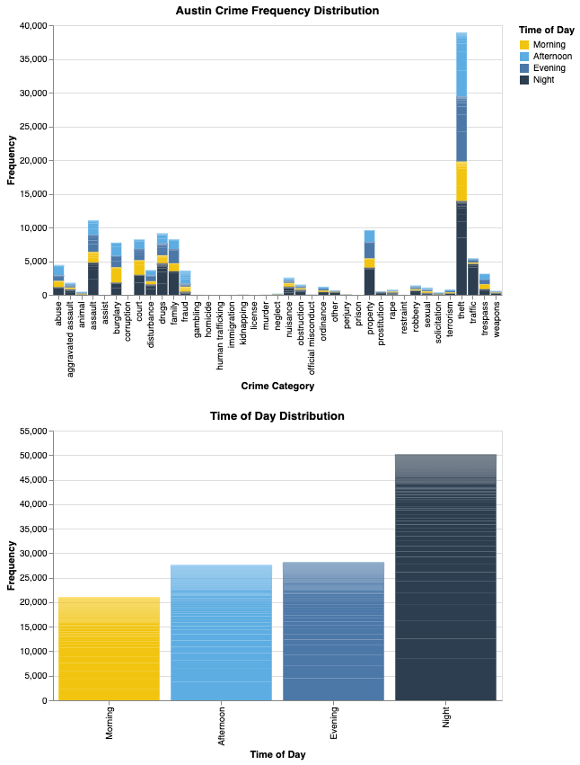

# austin-crime-in-color
## Austin Crime Frequency Visualization

This project was created as part of a group assignment in my *Elements of Data Visualization* course. My contribution was this interactive, dual-histogram chart built using Python and Altair.

The visualization helps answer the following key questions:
- What types of crime are most common in Austin?
- When during the day do certain crimes tend to occur?
- What crimes should residents be most aware of, depending on location or time?

## 🔧 Tools Used
- Python  
- Altair  
- pandas  
- Public data from [Austin.gov crime datasets](https://data.austintexas.gov/)

## Visualization Features
- **Histogram 1** shows the frequency of crime types, categorized and color-coded.
- **Histogram 2** shows when crimes occur (Morning, Afternoon, Evening, Night).
- **Interactivity**:
  - Click on a crime category to filter the time-of-day histogram below.
  - Hover for tooltips including crime type, category, count, and time of day.
- Consistent color theme:  
  - Morning – Yellow  
  - Afternoon – Light Blue  
  - Evening – Navy  
  - Night – Dark Blue  

## My Contribution
I designed and coded this visualization using Altair. I handled:
- Cleaning and transforming the data for visual use
- Writing the interactive selection logic
- Customizing the color scale and tooltips
- Final layout and styling of both linked histograms

To run the visualization:
1. Install the required packages: `pandas`, `altair`
2. Open the `.ipynb` and sample `.csv` file and run in a Colab or Jupyter environment
- **Note: Full dataset too large for GitHub, available upon request.**

This project helped me develop strong skills in turning raw public data into accessible, interactive insights, and I had fun doing it!

## Visualization PNG

